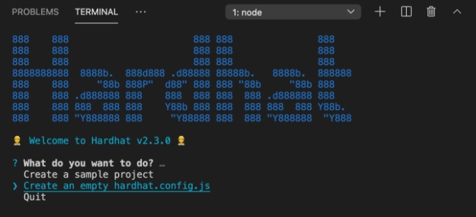

## Yield Farming Tutorial

Yield farming is the concept of incentivizing users with passive income in exchange for providing liquidity. The first step in yield farming involves adding funds to a liquidity pool, which are essentially smart contracts that contain funds. These pools provide liquidity to a marketplace where users can exchange, borrow, or lend tokens. Once you’ve added your funds to a pool, you’ve officially become a liquidity provider. In return for staking your finds in the pool, you’ll be rewarded with fees generated from the underlying DeFi platform. Reward tokens themselves can also be deposited in liquidity pools, and it’s common practice for people to shift their funds between different protocols to chase higher yields.

### 1. Environment and Dependencies Setup

Open up your code editor (I'm using [Visual Studio Code](https://code.visualstudio.com/)) and create a new directory for this project.
```
mkdir hw-farm
```

Install [Node js](https://nodejs.org/en/) if you have not done so.

In the project directory, install the [Hardhat](https://hardhat.org/) module:
```
npm i --save-dev hardhat
```

Open up Hardhat with `npx hardhat`.



Select the `Create an empty hardhat.config.js` option.

Install dependencies for TypeScript:
```
npm i --save-dev ts-node typescript
```

For testing, install the dependencies for [Chai](https://www.chaijs.com/):
```
npm i --save-dev chai @types/node @types/mocha @types/chai
```

We’ll be using an ERC20 token as both the staking token and as the yield rewarded to users. [OpenZeppelin](https://openzeppelin.com/) offers various contract libraries for developers. They also offer excellent testing tools. Install the dependencies for contracts and testing tools:
```
npm i --save-dev @openzeppelin/contracts @openzeppelin/test-helpers
```

During testing, we’ll need to simulate the passing of time. Install the dependcies needed for OpenZeppelin’s `time.increase()` function:
```
npm i --save-dev @nomiclabs/hardhat-web3 @nomiclabs/hardhat-waffle
```

Change the `hardhat.config` to TypeScript:
```
mv hardhat.config.js hardhat.config.ts
```

Next change the Solidity version and include the `hardhat-waffle` and `hardhat-web3` imports in the `hardhat.config.ts`:
```
import "@nomiclabs/hardhat-waffle";
import "@nomiclabs/hardhat-web3"

export default {
  solidity: "0.8.4",
};
```

### 2. Contracts

#### 2.1 ERC20 HWToken Contract

In this tutorial, we will rewards users with HWTokens for staking the MockDai tokens.  The `HW` are just my initials, you can change them to whatever you like.

In the project directory  `hw-farm`, create a `contracts` folder.  In the `contracts` folder, create a new Solidity file `HWToken.sol`.
```
mkdir contracts
```

To build the ERC20 HW token contract, import the `ERC20` contract from OpenZeppelin while also importing OpenZeppelin’s `AccessControl.sol` contract. 

The `AccessControl` contract allows us to implement role-based access control mechanisms.  In our case, we only want users/contracts with the `MINTER` role to be able to mint new tokens.

After declaring the imports, we define the `MINTER` role by using a `bytes32` identifier and exposed it in the external API using a `public constant` hash digest.

In the constructor, we assign the `DEFAULT_ADMIN_ROLE` to the creator of the contract.

We will override the `mint()` function to enforce a check that the caller has the `MINTER` role.
```
pragma solidity 0.8.4;

import "@openzeppelin/contracts/token/ERC20/ERC20.sol";
import "@openzeppelin/contracts/access/AccessControl.sol";

contract HWToken is ERC20, AccessControl {

    bytes32 public constant MINTER_ROLE = keccak256("MINTER_ROLE");

    constructor() ERC20("HWToken", "HWT") {
        _setupRole(DEFAULT_ADMIN_ROLE, msg.sender);
    }

    function mint(address to, uint256 amount) public {

        require(hasRole(MINTER_ROLE, msg.sender), "Caller is not the minter");

        _mint(to, amount);
    }
}
``` 

#### 2.2 MockERC20 Contract

In our yield farming contract, users will be staking `MockERC20` tokens, to receive passive `HWToken` rewards. We named our staking token `MockDai`, but you can use any name you wish by using parameters in the constructor.

In the `contracts` folder, create a `mocks` folder.

In the `mocks` folder, create a new file `MockERC20.sol`.

Import OpenZeppelin’s `ERC20.sol` contract, and input the following:
```
pragma solidity 0.8.4;

import "@openzeppelin/contracts/token/ERC20/ERC20.sol";

contract MockERC20 is ERC20 {

    constructor(
        string memory name,
        string memory ticker
    ) ERC20(name, ticker) {}

    function mint(address to, uint256 amount) public {
        _mint(to, amount);
    }
}
```

#### 2.3 HWFarm Contract

In our yield farming contract, there will be 3 core function. We need to allow users to stake their funds, unstake their funds, and withdraw their yield. 

In the `contracts` folder, create a file `HWFarm.sol`.

By now, your project structure should look somethings like this:


In `HWFarm.sol`, import both the `HWToken` contract and OpenZeppelin’s `IERC20` contract. 

We declare the following state variable mappings:
| Variable | Purpose | 
| --- | --- |
| `stakingBalance` | Mapping of user address to the user staking balance (MockDai) |
| `isStaking` | Mapping of user address to the user staking status |
| `startTime` | Mapping of user address to the timestamp of the user most recent stake. Use to calculate the yield of a users' staking.  |
| `hwBalance` | Mapping of user address to the user reward `HWToken` balance |

We also define events for the 3 core functions for the front-end.
```
pragma solidity 0.8.4;

import "@openzeppelin/contracts/token/ERC20/IERC20.sol";
import "./HWToken.sol";

contract HWFarm {

    // userAddress => stakingBalance
    mapping(address => uint256) public stakingBalance;
    // userAddress => isStaking boolean
    mapping(address => bool) public isStaking;
    // userAddress => timeStamp
    mapping(address => uint256) public startTime;
    // userAddress => hwBalance
    mapping(address => uint256) public hwBalance;

    string public name = "TokenFarm";

    IERC20 public daiToken;
    hwToken public hwToken;

    event Stake(address indexed from, uint256 amount);
    event Unstake(address indexed from, uint256 amount);
    event YieldWithdraw(address indexed to, uint256 amount);

    constructor(
        IERC20 _daiToken,
        HWToken _hwToken
        ) {
            daiToken = _daiToken;
            hwToken = _hwToken;
        }

    /// Core function shells
    stake() public {}
    unstake() public {}
    withdrawYield() public {}
}
```

Declare a `name` variable to identify the contract.
```
    string public name = "HW Farm";
```

Declare state variables preceded with the type (i.e. `IERC20`, `HWToken`) and visibility (public).
```
    IERC20 public daiToken;
    HWToken public hwToken;
```

Use the following convention in our contracts:
- Type - Use PascalCasing
- State Declaration - Use camelCasing
- Constructor Parameter - Use _underscoreCamelCasing

### 3. Core Functions

#### 3.1 Staking

The `stake()` function first requires that the `amount` parameter is greater than 0 and that the user holds enough mock DAI for the transaction. 

The function then checks if the user already staked DAI. If so, the contract adds the unrealized yield to the `hwBalance`. This ensures the accrued yield is not loss. 

Then contract then calls the `IERC20` `transferFrom` function. The user first must approve the contract’s request to move their funds. 

The function then updates the `stakingBalance`, `startTime`, and `isStaking` mappings to reflect the new staking.

Finally, it emits the `Stake` event to allow the front-end to listen for the said event.

```
function stake(uint256 amount) public {
    require(
        amount > 0 && daiToken.balanceOf(msg.sender) >= amount, 
        "You cannot stake zero tokens");
        
    if(isStaking[msg.sender] == true){
        uint256 toTransfer = calculateYieldTotal(msg.sender);
        hwBalance[msg.sender] += toTransfer;
    }

    daiToken.transferFrom(msg.sender, address(this), amount);
    stakingBalance[msg.sender] += amount;
    startTime[msg.sender] = block.timestamp;
    isStaking[msg.sender] = true;

    emit Stake(msg.sender, amount);
}
```

#### 3.2 Unstaking

The `unstake()` function requires the `isStaking` mapping to equate to true (which only happens when the `stake` function is previously called) and requires that the requested amount to unstake isn’t greater than the user’s staked balance. 

We get the yield from previous staking by calling the `calculateYieldTotal` function and storing the result in `yieldTransfer`.

Then we follow the [checks-effects-interactions](https://docs.soliditylang.org/en/v0.6.11/security-considerations.html) pattern by setting `balanceTransfer` to equal the `amount` to unstake and setting the `amount` to 0. This prevents users from abusing the function with re-entrancy.

We then reduce the `stakingBalance` mapping and transfer the mock DAI back to the user. 

Next, we update the `hwBalance` mapping. This mapping constitutes the user’s unrealized yield; therefore, if the user already held an unrealized yield balance, the new balance includes the prior balance with the current balance. 

Finally, we check whether the user still has staking tokens in the contract. If the user does not, the `isStaking` mapping is set to `false`.

> Note that Solidity version >= 0.8.0 includes `SafeMath` already integrated. If you’re using Solidity < 0.8.0, I highly encourage you to use a `SafeMath` library to prevent overflows.

```
function unstake(uint256 amount) public {
    require(
        isStaking[msg.sender] = true &&
        stakingBalance[msg.sender] >= amount, 
        "Nothing to unstake"
    );

    uint256 yieldTransfer = calculateYieldTotal(msg.sender);

    startTime[msg.sender] = block.timestamp;
    uint256 balanceTransfer = amount;
    amount = 0;
    stakingBalance[msg.sender] -= balanceTransfer;
    daiToken.transfer(msg.sender, balanceTransfer);
    hwBalance[msg.sender] += yieldTransfer;

    if(stakingBalance[msg.sender] == 0){
        isStaking[msg.sender] = false;
    }

    emit Unstake(msg.sender, amount);
}
```

#### 3.3 Withdrawing Yield

The `withdrawYield()` function requires that either the `calculateYieldTotal` function or the reward `HWToken` `hwBalance` holds a balance for the user. 

If there is a balance, this means that the user staked mock DAI more than once. The contract then adds the old `hwBalance` to the running yield total we received from the `calculateYieldTotal`. 

> Notice that the contract follows the checks-effects-interactions pattern; where `oldBalance` is assigned the accured `hwBalance`. Immediately thereafter, `hwBalance` is set to zero (to prevent re-entrancy). 

The `startTime` is set to the current timestamp in order to reset the accruing yield. 

Finally, the contract evokes the `hwToken.mint()` function which transfers `HWToken` directly to the user.


